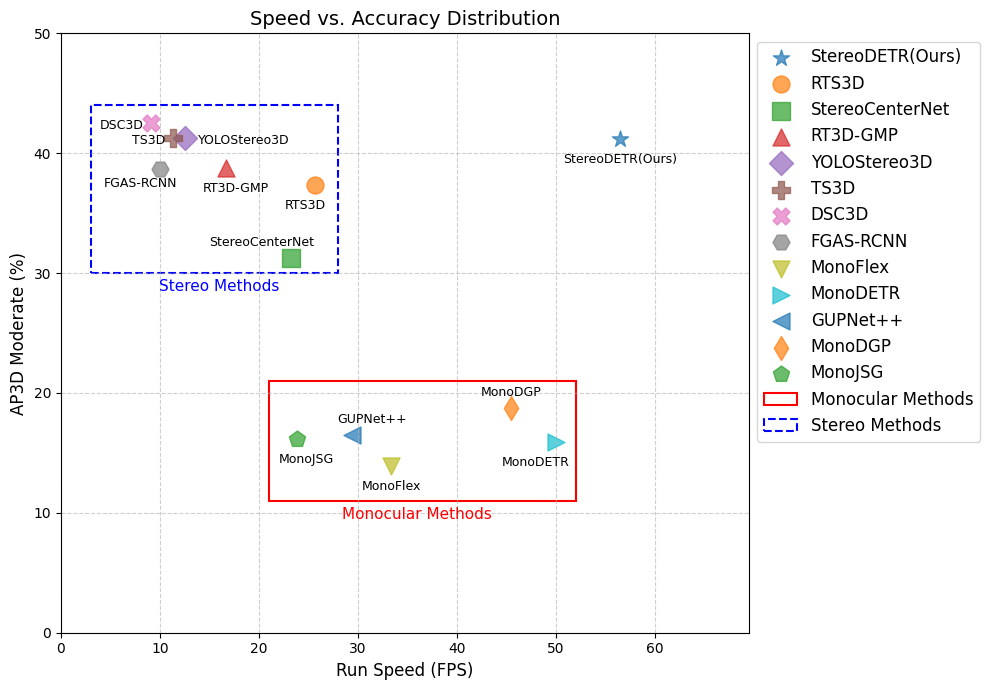
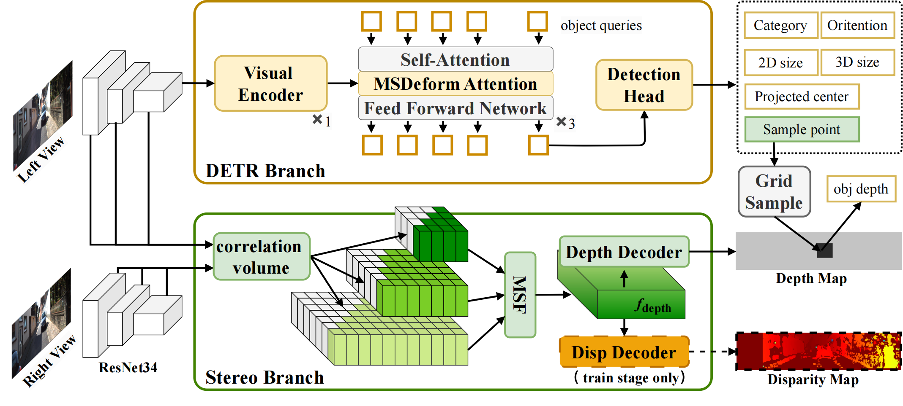

# StereoDETR 🚀

**🎉 Our paper has been ACCEPTED by *IEEE Transactions on Circuits and Systems for Video Technology (TCSVT)!***

**StereoDETR** is the **first stereo 3D detection framework that runs faster than monocular 3D detectors**, proving that binocular models can be both efficient and powerful.

📄 **Paper:**  
[StereoDETR: Stereo-based Transformer for 3D Object Detection](https://arxiv.org/abs/2511.18788)

[中文知乎解读](https://zhuanlan.zhihu.com/p/1977105087416538258)

## 🚀 Speed–Accuracy Comparison

StereoDETR achieves **higher accuracy** while running **faster than monocular 3D detectors**.

<p align="center">
  
</p>

*StereoDETR vs. previous monocular and stereo 3D detectors.*
## 🏗️ Architecture

<p align="center">
  
</p>

*Overall architecture of StereoDETR.*

## install
Follow [MonoDETR](https://github.com/ZrrSkywalker/MonoDETR)   

1. Clone this project and create a conda environment:
```bash
git clone https://github.com/shiyi-mu/StereoDETR-OPEN.git
cd StereoDETR-OPEN

conda create -n stereodetr python=3.8
conda activate stereodetr
```

2. Install pytorch and torchvision matching your CUDA version:
```bash
conda install pytorch torchvision cudatoolkit
# We adopt torch 1.9.0+cu111
```

3. Install requirements and compile the deformable attention:
```bash
pip install -r requirements.txt

cd lib/models/monodetr/ops/
bash make.sh

cd ../../../..
```

##  train model
```bash
bash scripts/001-eval-final_exp1.sh
```

## eval
```bash
cp checkpoint_best.pth outputs/001_final_exp1/stereodetr
bash scripts/001-eval-final_exp1.sh
```

## checkpoints
- [train on train split only](https://drive.google.com/drive/folders/1VoDDW-LSkpo6OfKTmEp_UXtKXEJJfmAU?usp=sharing)


## Acknowledgements

This project builds upon previous works.  
We sincerely thank the authors for open-sourcing their code:  

- [MonoDETR](https://github.com/ZrrSkywalker/MonoDETR)  
- [MonoDGP](https://github.com/PuFanqi23/MonoDGP)  
